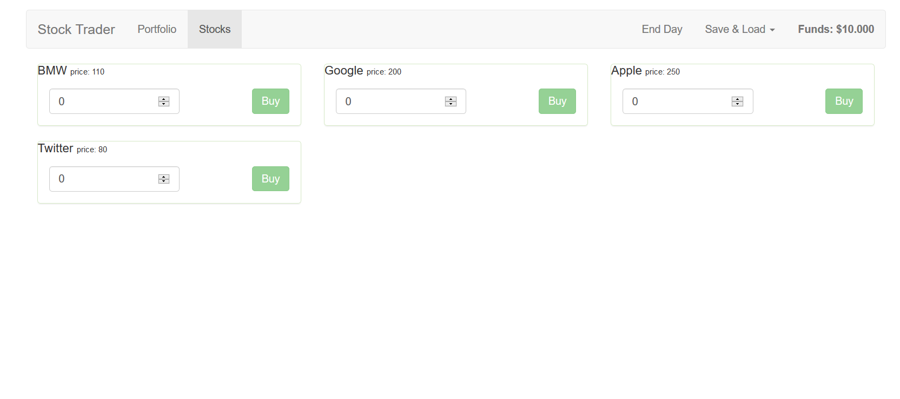

# Simple Stock Trader

**A Vue.js project made with Vuex, Vue-Router, Vue-Resource and Bootstrap**

This little project was implemented as a final project of the
[Vue - The complete Guide](https://www.udemy.com/course/vuejs-2-the-complete-guide/) course taught by
Maximilian Schwarzmüller. It combines the feature set of Vue JS, Vuex, Vue-Router and Vue-Resource.

---

- You can buy stocks and sell them. If you hit "end day" the stocks will alter their prices. 
- You can save and load your data (portfolio and stock prices) from an external database.

## Screenshot


## Build Setup

Clone or download the project, make sure you have nodeJS installed.
```cd``` into the projects root folder and open up a shell.

``` bash
# install dependencies
npm install / yarn install

# serve with hot reload at localhost:8080
npm run dev / yarn run dev

# build for production with minification
npm run build / yarn run dev
```

For detailed explanation on how things work, consult the [docs for vue-loader](http://vuejs.github.io/vue-loader).
